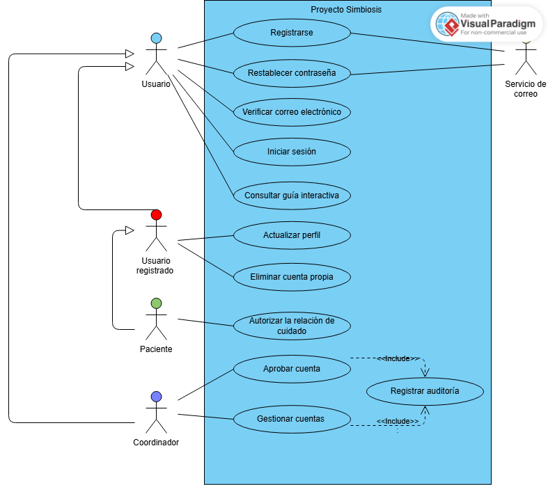

# Modelo de casos de uso de Proyecto Simbiosis

| Versión | Fecha | Estado |
| --- | --- | --- |
| 1.3 | 07/10/2026 | Plantilla |

**Iteración de referencia:** E1

Este documento recoge el modelo de casos de uso del proyecto. Se completa a medida que se incorporan funciones. Los diagramas muestran distintas vistas del mismo modelo.

Sustituye las indicaciones entre corchetes por tu contenido. Añade filas cuando las necesites. Si un apartado aún no se ha trabajado, indica que está pendiente. No inventes respuestas para completar la plantilla.

**Trabajo en E1.** El producto principal es el diagrama de la primera vista. Usa las funciones del apartado 4 del [plan de E1](../planificacion/plan-iteracion-e1.md). La anotación de alcance puede ser breve. Los apartados siguientes permiten organizar el modelo y continuarlo después. No se requieren descripciones detalladas de los casos en E1 ni se establece una entrega adicional.

**Evolución del documento.** Mantén este archivo al avanzar de iteración. Conserva los identificadores de los elementos que sigan siendo los mismos. Actualiza los datos iniciales cuando registres una nueva versión del modelo. Cambia el estado de «Plantilla» a «Borrador» al empezar a completarlo. Usa «Revisado» solo después de la revisión correspondiente. Git conservará los estados registrados en commits.

## 1 Alcance del modelo

Explica qué funcionalidad representa el modelo en su estado actual. Indica qué funciones quedan pendientes. En E1, remite al plan para situar el alcance. No copies el catálogo completo.

El modelo representa las funciones del apartado 4 del plan de E1: El registro local y la verificación del correo (UR-01), el acceso y contraseña (UR-02), el perfil y la cuenta propia (UR-03), la gestión básica de cuentas por el coordinador (UR-13) y la ayuda y bienvenida (UR-12). La cobertura es parcial. Dejando pendientes el acceso con Google, el bloqueo y la expulsión, el fin de la relación de cuidado, la ayuda sobre otros módulos y los UR-04 a UR-11.

En iteraciones posteriores, actualiza el alcance acumulado. Distingue las funciones nuevas de las que ya estaban representadas. Una vista puede cubrir solo una parte de un UR o de un módulo.

## 2 Actores

Registra los roles externos que participan en las funciones representadas. Un actor puede ser una persona o un sistema externo. Describe cada rol con una frase breve. No confundas estos roles con las personas del equipo de desarrollo.

| Nombre del actor | Rol que representa |
| --- | --- |
| Usuario | Es la persona que se registra, verifica su correo, inicia sesión, restablece su contraseña o consulta la guía. |
| Usuario registrado | Es la persona que ya se encuentra registrada en la plataforma pudiendo gestionar su perfil y cuenta. |
| Paciente | Es el usuario registrado que autoriza la relación de cuidado. |
| Coordinador	| Es el que gestiona las cuentas: las aprueba, las suspende y las elimina.|
| Servicio de correo |	Es un sistema externo que se encarga de enviar el correo de verificación y el enlace de restablecimiento de cuenta. |

Mantén los mismos nombres en las tablas, los diagramas y las descripciones.

El usuario es el actor general. El usuario registrado y coordinador lo especializan, y el paciente especializa a usuario registrado. El coordinador solo aprueba sus cuentas.
## 3 Casos de uso

Registra los casos que aparecen en el modelo. Asigna a cada caso un identificador estable. Escribe el nombre con un verbo y un objeto. Resume el objetivo sin describir todos sus pasos.

| Identificador | Nombre | Objetivo | Participantes |
| --- | --- | --- | --- |
| UC-01 | Registrarse | Crear una cuenta local, pendiente hasta poder verificar el correo. | Usuario y Servicio de correo |
| UC-02 | Verificar correo electrónico | Confirmar el correo para completar el registro. | Usuario |
| UC-03 | Restablecer contraseña | Recuperar el acceso mediante un enlace al correo. | Usuario y Servicio de correo |
| UC-04 | Aprobar cuenta | Aprobar cuentas de cuidador y nutricionista. | Coordinador |
| UC-05 | Eliminar cuenta propia | Eliminar la propia cuenta tras comprobar la identidad. | Usuario registrado |
| UC-06 | Autorizar la relación de cuidado | Autorizar que un cuidador se asocie al paciente. | Paciente |
| UC-07 | Consultar guía interactiva | Obtener ayuda sobre las funciones seleccionadas. | Usuario |
| UC-08 |	Iniciar sesión | Acceder con correo y contraseña.| Usuario |
| UC-09 |	Actualizar perfil |	Modificar datos personales y preferencias.| Usuario registrado |
| UC-10 |	Gestionar cuentas |	Listar, suspender y eliminar cuentas de usuario.| Coordinador |
| UC-11 |	Registrar auditoría| Registrar fecha, hora y acción de cada aprobación, suspensión o eliminación de cuentas.|	Sin actor principal propio |
El actor principal es el que busca el objetivo e inicia la interacción y el servicio de correo es actor de apoyo en UC-01 y UC-03.

Esta distinción se establece para cada caso de uso. Un mismo actor puede desempeñar funciones diferentes en distintos casos. No es necesario asignar un actor principal independiente a cada caso incluido.

Al ampliar el modelo, conserva los casos anteriores que sigan siendo válidos. Si revisas un caso, conserva su identificador cuando siga representando el mismo objetivo. No reutilices el identificador de un caso retirado para un caso diferente.

## 4 Diagramas del modelo

Añade la primera vista en E1. En iteraciones posteriores, incorpora las vistas necesarias y revisa las anteriores cuando cambien elementos compartidos.

Para cada vista, incluye un título, una frase sobre su alcance y el diagrama. Todas las vistas deben usar la misma frontera del sistema y nombres compatibles.

### 4.1 Primera vista

**Título:** Casos de uso de acceso, cuentas y ayuda (E1).

**Alcance:** Funciones del apartado 4 del plan de E1. Cobertura parcial(1).

[Inserta aquí el diagrama.]

Si una decisión necesita aclaración, puedes añadir una nota breve junto al diagrama.

**Nombre y ubicación de la imagen.** Guarda las imágenes en `docs/modelos/imagenes/`. Usa este patrón:

```text
tipo-de-diagrama-ambito.png
```

El tipo indica qué diagrama contiene la imagen. El ámbito indica qué funciones o elementos representa. Usa minúsculas, sin tildes, eñes ni espacios, y separa las palabras con guiones.

Para la primera vista de E1, utiliza este nombre común:

```text
casos-de-uso-acceso-cuentas-ayuda.png
```

Inserta la imagen con este enlace relativo:

```markdown

```

Al revisar esta vista, conserva el nombre del archivo y actualiza la imagen. No añadas la iteración, la versión, la fecha ni tu nombre al archivo. Git conservará las versiones registradas en commits.

Si añades una vista diferente, utiliza otro ámbito. Si necesitas varias imágenes del mismo ámbito, añade un detalle que las distinga. La [guía de modelos](README.md) recoge los ejemplos y la convención que se ampliará para otros tipos de diagramas.

Conserva también el archivo editable de la herramienta cuando esté disponible. Usa el mismo nombre base y la extensión propia de la herramienta. Al revisar una vista, actualiza su imagen y su explicación. Las versiones anteriores quedarán en los commits que incluyan esos archivos.

## 5 Respaldo en los requisitos

Indica los UR y FR que respaldan las decisiones del modelo. Añade los NFR que condicionen un caso o su descripción. Explica la relación cuando el identificador no baste para comprenderla.

En E1 basta con un respaldo breve del diagrama. La tabla permite ampliar la trazabilidad después. No es necesario crear un caso independiente para cada FR o NFR.

| Elemento del modelo | UR y FR de referencia | NFR pertinentes | Relación con los requisitos |
| --- | --- | --- | --- |
| UC-01 Registrarse | UR-01: FR-001 | — | Registro local con solicitudes de perfil. |
| UC-02 Verificar correo electrónico | UR-01: FR-010 | — | Completa el registro. |
| UC-03 Restablecer contraseña | UR-02: FR-016 | — | Enlace al correo. Condiciones del enlace pendientes de aclarar. |
| UC-04 Aprobar cuenta | UR-13: FR-181 | — | Incluye UC-11. |
| UC-05 Eliminar cuenta propia | UR-03: FR-020 | — | Exige la contraseña actual. |
| UC-06 Autorizar la relación de cuidado | UR-01: FR-194 | — | Autorización expresa del paciente. |
| UC-07 Consultar guía interactiva | UR-12: FR-172, FR-207 | — | Ayuda y recorrido de bienvenida. |
| UC-08 Iniciar sesión | UR-02: FR-015 | NFR-005 | NFR-005 pendiente de enlazar en el catálogo. |
| UC-09 Actualizar perfil | UR-03: FR-019 | — | Alias y correo no modificables. |
| UC-10 Gestionar cuentas | UR-13: FR-182, FR-183, FR-184 | — | Efectos de la suspensión pendientes de aclarar. Incluye UC-11. |
| UC-11 Registrar auditoría | UR-13: FR-185 | — | Caso incluido por UC-04 y UC-10. |

Consulta el [catálogo canónico](../requisitos/catalogo-requisitos.md) y la [SRS](../requisitos/srs.md). Si falta una condición, indica que está pendiente de aclaración. No la presentes como un requisito confirmado.

## 6 Descripciones de los casos de uso

**Desarrollo posterior.** Este apartado queda pendiente en E1. Se completará cuando se trabajen las descripciones de los casos de uso. La existencia de este apartado no exige describirlos ahora.

Repite el esquema siguiente para cada caso que se vaya a describir. Usa el identificador y el nombre del apartado 3. El nivel de detalle dependerá del trabajo previsto para ese caso.

### 6.1 Descripción de un caso

**Identificador y nombre:** Pendiente

**Estado de la descripción:** Pendiente

**Objetivo:** Pendiente

**Participantes:** Pendiente

**Condiciones previas:** Pendiente

**Inicio:** Pendiente
**Escenario principal:** Pendiente

**Alternativas y errores:** Pendiente

**Resultado:** Pendiente

**Reglas y NFR pertinentes:** Pendiente

**Preguntas abiertas:** Pendiente

Describe el comportamiento que se necesita. Las decisiones sobre componentes, clases o tecnologías pertenecen al trabajo de arquitectura y diseño.

## 7 Continuidad entre iteraciones

En E1, indica que esta es la primera vista del modelo. A partir de la siguiente iteración, resume qué elementos se incorporan y cuáles se revisan, conservan o retiran.

Esta es la primera vista del modelo, creada en E1. En ella se incorpora de UC-01 a UC-11 y los cinco actores. Las funciones pendientes del apartado 1 se incorporarán en iteraciones posteriores.

Este apartado describe la evolución del modelo. No sustituye la evaluación de la iteración. Los resultados de arquitectura, las pruebas y las desviaciones del plan se registran en sus documentos correspondientes.

El historial completo de este archivo está en Git. Para localizar el estado de cierre de una iteración, utiliza el commit identificado al cerrar esa iteración. La [guía de esta carpeta](README.md) explica el procedimiento.
